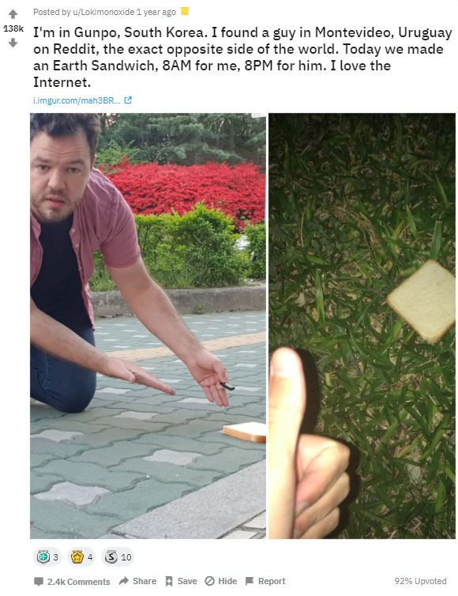

# 🍞 Earth Sandwich

날씨 API와 Three.js를 활용한 **"지구 샌드위치"** 시뮬레이터
## 개요

지구 정반대편에 있는 두 사람이 동시에 빵을 놓아 지구를 샌드위치처럼 만드는 유명한 인터넷 챌린지인
**"지구 샌드위치(Earth Sandwich)"** 밈에서 아이디어를 얻었습니다.

날씨 API를 다뤄야 하는 과제에 맞춰 이 밈을 시뮬레이터로 만들면 재밌겠다는 생각에서 시작했습니다.
도시를 고르면 지구 반대편 지점을 자동 계산해서 두 곳의 실시간 날씨를 비교해볼 수 있게 만들었습니다.

## 기능

- 도시 검색 / 추천 카드로 날씨 조회
- Leaflet 지도를 클릭해서 원하는 위치 선택
- 선택한 도시 ↔ 지구 반대편(대척점) 도시 날씨 동시 비교
- 온도·습도로 "식빵 상태"(바삭 / 마름 / 눅눅 / 꽁꽁얼음 / 완벽) 판정
- 시도할수록 지구본에 빵이 하나씩 쌓이는 연출
- C / F 온도 단위 전환
- Three.js 3D 지구본을 드래그해서 원하는 위치 선택

## 추가한 API

- **OpenWeatherMap** - 도시명 / 좌표 기반 실시간 날씨 조회
- **Leaflet + OpenStreetMap** - API 키 없이 쓸 수 있는 지도 (위치 클릭 선택용)

## 추가한 내용

- **Pinia (sandwichStore)** - 선택한 도시, 시도 횟수, 연출 진행 여부, 승리 상태 등 게임 진행 상태 관리
- **Vue Router** - 홈 / 상세 / 승리 / 연습 페이지 라우팅
- **Element Plus → 커스텀 UI** - 직접 만든 "빵 크러스트" 테마 컴포넌트로 대부분 교체
- **Three.js** - 텍스처 입힌 3D 지구본, 드래그 회전, 표면에 붙는 빵 오브젝트, 카메라 연출 구현

## 게임 방법

### 방법

1. 검색 · 추천 카드 · 지구본 드래그 · 지도 클릭 중 하나로 도시(또는 좌표) 선택
2. 선택한 위치의 위도/경도로 지구 정반대편 좌표 자동 계산
3. 두 지점의 실시간 날씨를 동시에 조회
4. 온도·습도 기준으로 각 지점의 "식빵 상태" 판정

### 승리 조건

선택한 도시와 지구 반대편 도시가 둘 다 **"완벽한"** 식빵 상태일 때 승리!
승리하면 그때까지의 시도 횟수와 함께 승리 화면으로 이동합니다.
